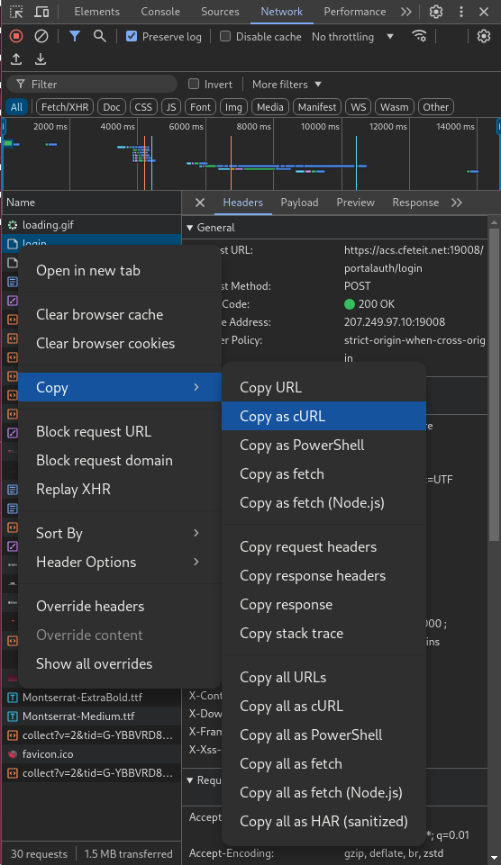

# Automated-Login-CFE_TEIT
Conjunto de scripts para el login automático a la red de Internet para Todos de la CFE TEIT.

## Consideraciones
Este proyecto fue creado con fines educativos y no se recomienda su uso en producción, ya que puede violar los términos de uso de la CFE TEIT. El uso de este proyecto es responsabilidad del usuario.

Los scripts han sido probados en un entorno Linux, específicamente en Raspberry Pi OS en la Raspberry Pi 2 con un adaptador de red USB, por lo que no se garantiza su funcionamiento en otros sistemas operativos.

Se requiere de previo conocimiento de las herramientas utilizadas para poder modificar los scripts a sus necesidades. Node, npm, python y bash son las herramientas utilizadas en este proyecto.

La conexión inicial a la red de la CFE TEIT debe ser manual y de acuerdo al sistema operativo que se esté utilizando, ya que no se incluye un script para la conexión inicial.

## Puppeteer

La primera iteración de este proyecto se realizó con Puppeteer, así que es necesario tener instalado Node.js y npm para poder ejecutar, si bien este script no es el más eficiente, es el más sencillo de usar. Esta dividido en dos scripts, uno que es ejecutado al inicio del sistema y otro que es ejecutado cada cierto tiempo para mantener la conexión activa.

### cfe-boot.sh y cfe-boot-puppeteer.js

El script en bash se encarga de limpiar la caché generada por Puppeteer y de ejecutar el script en Node.js. El script en Node.js se encarga de abrir una nueva pestaña en el navegador y de navegar a la página de login de la CFE TEIT y hacer click en el botón de "Aceptar".

### cfe-puppeteer.sh y cfe.js

El script en bash se encarga de limpiar la caché generada por Puppeteer y de ejecutar el script en Node.js. El script en Node.js se encarga de abrir una nueva pestaña en el navegador con la URL obtenida por el primer script y de navegar a la página de login de la CFE TEIT y hacer click en el botón de "Aceptar".

## Bash

La segunda iteración de este proyecto se realizó con scripts en bash, ya que Puppeteer no es la mejor opción para este tipo de tareas. Se crea un script en bash que se encarga de hacer una petición POST a la página de login de la CFE TEIT y un servicio en systemd para ejecutar el script cada cierto tiempo.

### cfe.sh

El script esta diseñado para que en conjunto con el servicio de systemd se ejecute cada cierto tiempo y mantenga la conexión activa, al mismo tiempo que va creando un log con la fecha y hora de cada petición.

Para configurarlo es necesario cambiar la petición cURL con los datos obtenidos de realizar la conexión manualmente a través del navegador.

Si el dispositivo está siendo utilizado en modo headless, es necesario obtener una conexión bridge al dispositivo para poder realizar la captura de la petición, ya sea mediante un túnel SSH o haciendo un bridge a través de la red local.

Para la Raspberry Pi 2 con Raspberry Pi OS, se puede configurar la conexión bridge del adaptador de red a el puerto ethernet con el siguiente comando:

```bash
sudo nmcli c add con-name custom-shared-con type ethernet ifname eth0 ipv4.method shared ipv6.method ignore
sudo nmcli c up custom-shared-con
```

Una vez configurado el bridge, es necesario iniciar el proceso de login manualmente.

En la pantalla de login:


Es necesario aceptar los Términos y Condiciones para activar el botón de "Aceptar":


Se debe abrir la consola del navegador, activando la preservación de logs, y damos click derecho el método POST llamado "login", navegando hasta llegar a "Copiar como cURL":



Es necesario cambiar los datos de la petición cURL en el script cfe.sh con los datos obtenidos de la petición.

### check-internet.py

El script realiza una serie de intentos para conectarse a una URL (por defecto, http://google.com) y verifica si la respuesta es exitosa (código de estado 200). Si después de varios intentos (5 por defecto) no se logra establecer la conexión, el script procede a reiniciar el dispositivo.

Para utilizar este script, simplemente ejecútelo en su entorno Python. Puede ser útil configurarlo como un servicio en systemd para que se ejecute automáticamente en el arranque del sistema y verifique periódicamente la conexión a Internet, o bien, ejecutarlo mediante crontab.

```bash
*/5 * * * * /usr/bin/python3 /path/to/check-internet.py
```